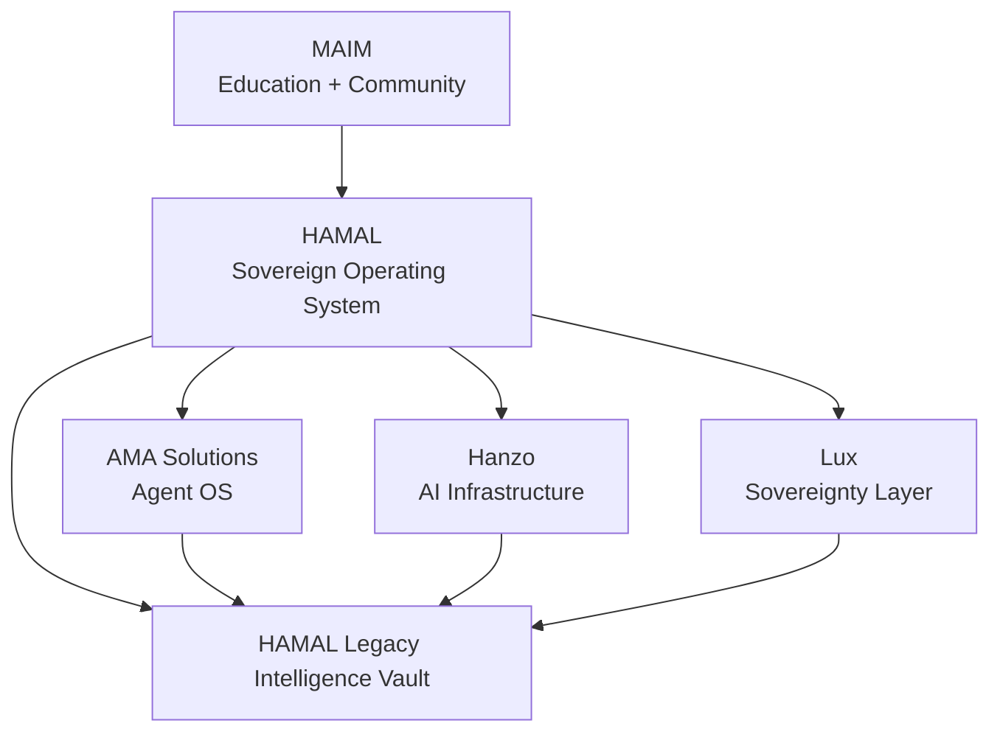

# HAMAL Ecosystem Map

Status: canonical architecture
Owner: Major Dream Williams

This document defines the boundary between MAIM, HAMAL, AMA Solutions, Hanzo, and Lux.

It exists to prevent architectural drift.

## Core Principle

```txt
HAMAL orchestrates.
AMA operates.
Hanzo provides AI infrastructure.
Lux provides sovereignty.
MAIM teaches people how to use the system.
```

## Ecosystem Model

```txt
                    HAMAL
        The sovereign operating system

        ┌────────────┬────────────┬────────────┐
        │            │            │
      HANZO        AMA           LUX
   AI + Infra    Agent OS    Sovereignty
```

## MAIM

MAIM is the education and community layer.

Owns:

- ABC framework
- Knowledge sessions
- Command Room
- beginner AI education
- community learning rhythm
- human-facing curriculum
- founder voice and teaching philosophy

MAIM teaches people how to use the system.

## HAMAL

HAMAL is the sovereign operating system.

HAMAL stands for the combined operating layer across:

```txt
Hanzo
AMA Solutions
Lux
```

HAMAL owns:

- orchestration
- knowledge layer
- community intelligence
- legacy intelligence
- system routing
- cross-engine coordination
- long-term operating memory

HAMAL is not another AI model.

HAMAL decides when to use Hanzo, when AMA agents should act, and when Lux should record ownership, identity, provenance, or credentials.

## AMA Solutions

AMA Solutions is the agent operating system.

Owns:

- 144-agent architecture
- agent workspaces
- playbooks
- contracts
- routing
- automation behavior
- operational intelligence
- handoffs
- agent memory

AMA operates.

## Hanzo

Hanzo is AI infrastructure.

Owns:

- AI services
- model routing
- tools
- inference
- execution
- APIs
- future agent runtime capabilities
- infrastructure primitives

HAMAL can use Hanzo as a preferred AI infrastructure provider.

This repo does not redefine Hanzo and does not change Hanzo source code.

Hanzo source lives separately:

```txt
https://github.com/hanzo-apps/hanzo.ai.git
```

## Lux

Lux is the sovereignty layer.

Owns:

- identity
- credentials
- blockchain
- provenance
- ownership
- tokenization
- digital assets
- legacy verification

Lux provides sovereignty.

## Ownership Table

| Capability | Owner |
| --- | --- |
| ABC Framework | MAIM |
| Knowledge Sessions | MAIM |
| Community Learning | MAIM |
| 144 Agents | AMA |
| Agent Workspaces | AMA |
| Automation Playbooks | AMA |
| Legacy Intelligence Vault | HAMAL |
| Knowledge Layer | HAMAL / MAIM, depending on audience |
| AI Infrastructure | Hanzo |
| Model Routing | Hanzo |
| Identity and Credentials | Lux |
| Blockchain and Provenance | Lux |

## Language Rules

Use this language:

```txt
HAMAL uses Hanzo as AI infrastructure.
AMA agents operate the workflow.
Lux provides sovereignty.
MAIM teaches the human layer.
HAMAL Legacy Intelligence Vault.
```

Avoid this language:

```txt
Hanzo owns the whole operating system.
Hanzo replaces HAMAL.
Hanzo agents own AMA workflows.
Hanzo Legacy Intelligence Vault.
```

## Architecture Flow



## Practical Rule

Before naming a new capability, ask:

```txt
Who owns this?
Who powers it?
Who operates it?
Who teaches it?
Who verifies sovereignty?
```

If those answers are unclear, do not implement yet.
