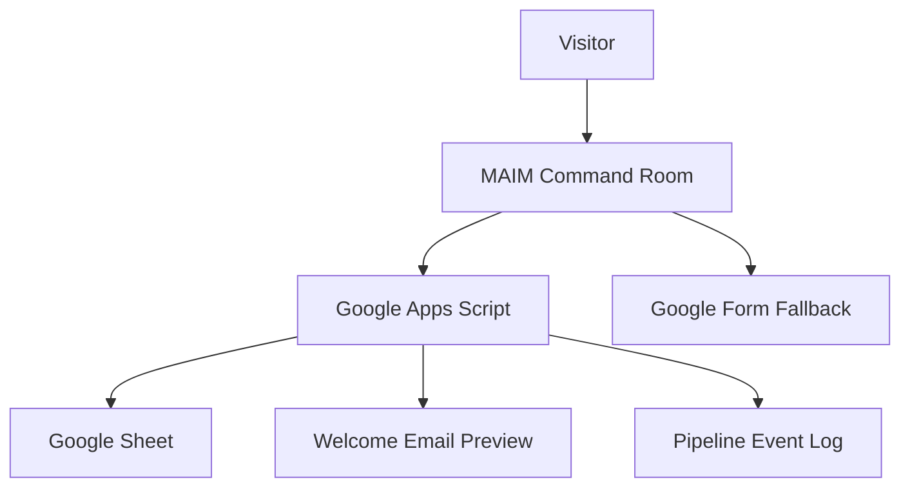
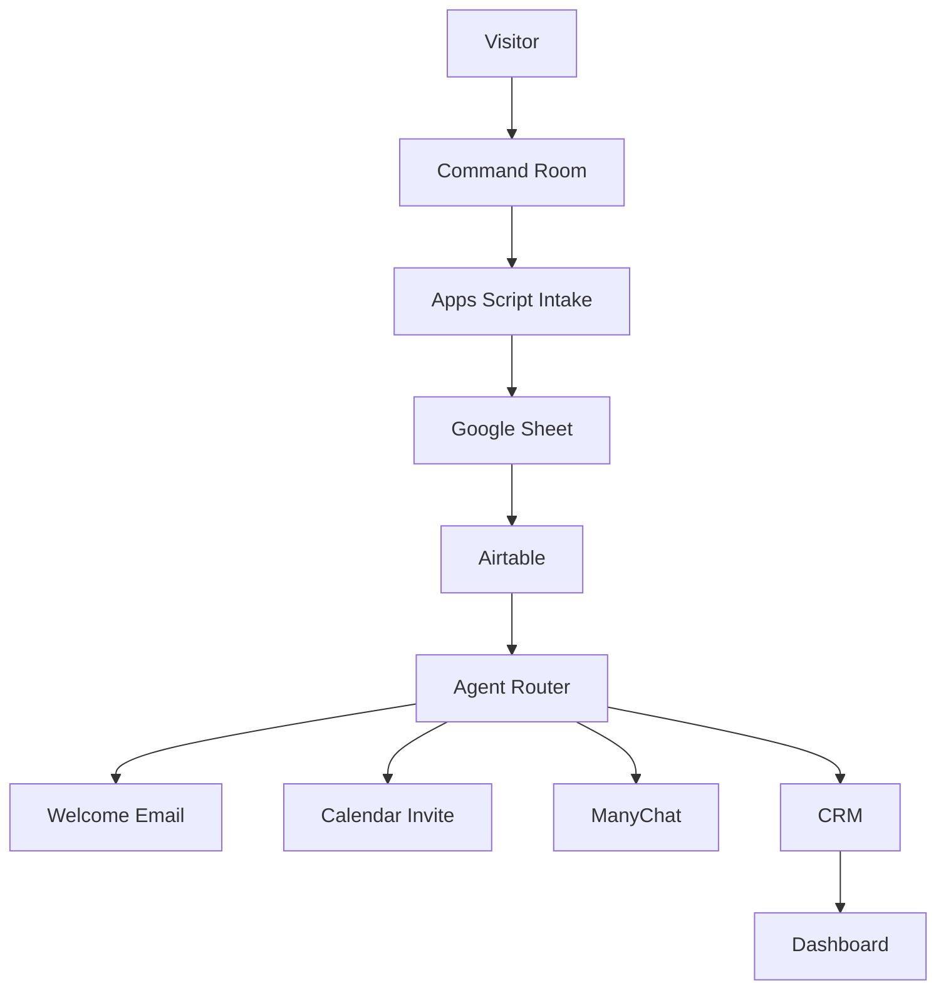

# MAIM Command Room System

Status: active architecture
Owner: Major AI Mindset

## Purpose

The MAIM Command Room is the front door to the platform.

It is not just a landing page. It is the entry point into knowledge sessions, ABC learning paths, prompt systems, agents, and future operational workflows.

## Current System



## Target System



## Enabled Now

- Command Room landing page.
- Apps Script registration intake.
- Google Sheet registration source log.
- Welcome email preview.
- Pipeline event log.
- Duplicate protection.
- Google Form fallback.

## Disabled Now

- Airtable sync.
- Live welcome email.
- Calendar invite.
- ManyChat.
- CRM write.

## Sprint Roadmap

```txt
Sprint 001 - Google Sheet + welcome email dry-run + event log
Sprint 002 - Airtable sync, still dry-run first
Sprint 003 - Welcome email only
Sprint 004 - Calendar invite
Sprint 005 - ManyChat
Sprint 006 - CRM
```

## Related Release Gates

```txt
docs/release-gates/v0.1.0.md
docs/release-gates/v0.1.1.md
docs/release-gates/v0.2.0.md
```
